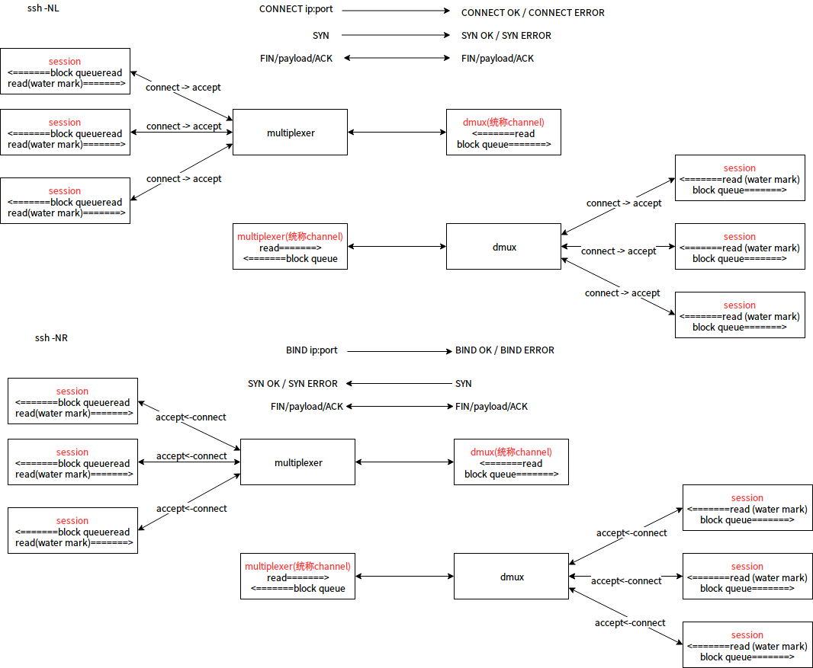

<!-- TOC -->

- [1. multiplexer dmux](#1-multiplexer-dmux)
- [2. 包头定义](#2-包头定义)
- [3. 单元测试](#3-单元测试)

<!-- /TOC -->


<a id="markdown-1-multiplexer-dmux" name="1-multiplexer-dmux"></a>
# 1. multiplexer dmux

```
input1 ======>|-------------|                   |------|======> output1
input1 ======>| multiplexer |====> channel ====>| dmux |======> output2
input1 ======>|-------------|                   |------|======> output3
```

这个项目比简单的proxy增加了一些难度(multiplexer维护一个客户端连接/dmux维护一组连接)

```
如果连接一一对应,那么利用tcp的阻塞接口即可方便的做到proxy
A 阻塞读-> proxy 阻塞写-> B
B <-阻塞写 proxy <-阻塞读 A

但是现在的问题是多连接变成了单连接,这样就不能阻塞在write了,因为还有其他连接包装的payload需要read呢

所以阻塞写,变成了非阻塞的扔到一个生产者消费者队列里
A 阻塞读-> proxy 非阻塞扔队列-> B
B <-非阻塞扔队列 proxy <-阻塞读 A

随即带来的问题是不能控制流量了
所以增加逻辑
1. 在阻塞读之前判断发送窗口是否超过水位
2. 成功向A或B发送数据后向channel发送一个降低水位的信息
```

如图所示,每个链接都维护`两个go routine`  ,分别是read和等待blockqueue


`ssh -NL`功能切入的思考点如下:  
* input方发送`CONNECT`给channel,再发送给dmux

multiplexer:
* input方 `SYN`,`FIN` 连接, `包装,穿透给`channel
* input方 `send` payload , send channel payload 
* channel方 `FIN` 连接, 辨别是哪个input方, 发送shutdown write
* channel方 `send` payload , 辨别是哪个input方, send input payload

dmux:
* channel方 `SYN`,`FIN`, 连接/shut down write指定的output
* channel方 `send`, send到指定的output
* output方 `FIN`, `包装,穿透给`channel
* output方 `send`, send channel

---

`ssh -NR`功能切入的思考点如下:  
* input方发送`BIND`给channel,再发送给dmux,dmux主动accept连接,分配id `SYN`给channel

其他是上面两者的反转


---
channel收发总结:
* channel `goroutine read` 扔给input/output `消息队列`, input/out goroutine接收到后`write`
* input/out `goroutine read` 扔给channel `消息队列`

流量控制:
* 从input/output收数据之前判断`发送字节数`是否达到`高水位`,如果达到`等待条件变量`直至水位之下
* 向output/input发送数据完毕之后,判断`接收字节数`是否达到`consume位置`,如果达到`向channel`发送consume消息降低水位
---

channel连接本身的思考:  
* multiplexer <- dmux 收到`FIN`, 关闭所有的input, `重连`
* multiplexer -> dmux 收到`FIN`, 关闭所有的output,  继续`accept` 新连接 处理

注意关闭input/output时:
* `等待`队列写input/output`唤醒`, goroutine的退出
* `等待`水位降低写channel`唤醒`,goroutine的退出

---

何时close input/output?:
* `两边`都进行了`半关闭`,再由read go routine统一回收

---

其他:
* 服务端要做成类似`ssh -NL / ssh -NR`一样,一个连接支持`多个映射关系`,`两种功能同时支持`


<a id="markdown-2-包头定义" name="2-包头定义"></a>
# 2. 包头定义

* len 4 byte
* id 4 byte
* cmd 1 byte (bool)
* if cmd == true, command

---

建立channel握手:
* CONNECT ip:port
* CONNECT OK
* BIND ip:port
* BIND OK
---

其他:
* FIN
* ACK xxx // xxx is bytes num

<a id="markdown-3-单元测试" name="3-单元测试"></a>
# 3. 单元测试

命令
```bash
cd common
go test common.go common_test.go
```
