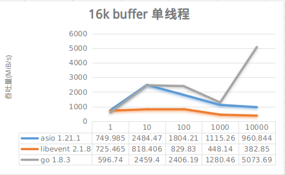

<!-- TOC -->

- [1. 说明](#1-说明)
- [2. 测试脚本](#2-测试脚本)
    - [2.1. 说明](#21-说明)
    - [2.2. asio](#22-asio)
    - [2.3. go](#23-go)
    - [2.4. libevent](#24-libevent)

<!-- /TOC -->


<a id="markdown-1-说明" name="1-说明"></a>
# 1. 说明

参考
* http://think-async.com/Asio/LinuxPerformanceImprovements
* https://sourceforge.net/projects/asio/ (asio单独库的下载)



安装asio的库
```bash
cd /media/yq/ST1000DM003/linux/reference/refer/asio-1.12.1
./configure
make
sudo make install 
```

<a id="markdown-2-测试脚本" name="2-测试脚本"></a>
# 2. 测试脚本

<a id="markdown-21-说明" name="21-说明"></a>
## 2.1. 说明
由于底层并发模型的区别,测试asio时部分参数采用我本机`Intel(R) Xeon(R) CPU E3-1231 v3 @ 3.40GHz`最大性能配比

* 缓冲区固定为16k(不需要太大)
* 时间90s
* 单线程
* 连接数量从1 10 100 1000 10000 不等

<a id="markdown-22-asio" name="22-asio"></a>
## 2.2. asio

```bash
cmake -DCMAKE_BUILD_TYPE=RELEASE
make

cat > ./bench.sh << EOF
#!/bin/bash

killall server
timeout=90
for bufsize in 16384; do
  for nothreads in 1; do
    for nosessions in 1 10 100 1000 10000; do
      echo "Bufsize: \$bufsize Threads: \$nothreads Sessions: \$nosessions"
      taskset -c 1 ./server 0.0.0.0 55555 \$nothreads \$bufsize & srvpid=\$!
      sleep 3
      taskset -c 2 ./client localhost 55555 \$nothreads \$bufsize \$nosessions \$timeout 
      kill -9 \$srvpid
      sleep 5
    done
  done
done

EOF

chmod +x bench.sh

```

<a id="markdown-23-go" name="23-go"></a>
## 2.3. go

```bash
mkdir bin

cd client 
go build client.go
mv client ../bin

cd ../server
go build server.go
mv server ../bin

cd ../bin


cat > ./bench.sh << EOF
#!/bin/bash
killall server
timeout=90
for bufsize in 16384; do
  for nosessions in 1 10 100 1000 10000; do
    echo "Bufsize: \$bufsize Sessions: \$nosessions"
    taskset -c 1 ./server 0.0.0.0:55555 \$bufsize & srvpid=\$!
    sleep 3
    taskset -c 2 ./client localhost:55555 \$bufsize \$nosessions \$timeout 
    kill -9 \$srvpid
    sleep 5
  done
done
EOF
chmod +x bench.sh

```
<a id="markdown-24-libevent" name="24-libevent"></a>
## 2.4. libevent

```bash
cmake -DCMAKE_BUILD_TYPE=RELEASE
make

cat > ./bench.sh << EOF
#!/bin/bash

killall server
timeout=90
bufsize=16384
nothreads=1

for nosessions in 1 10 100 1000 10000; do
  echo "Bufsize: \$bufsize Threads: \$nothreads Sessions: \$nosessions"
  taskset -c 1 ./server 2> /dev/null & srvpid=\$!
  sleep 3
  taskset -c 2 ./client 9876 \$bufsize \$nosessions \$timeout
  kill -9 \$srvpid
  sleep 5
done
EOF

chmod +x bench.sh
```

