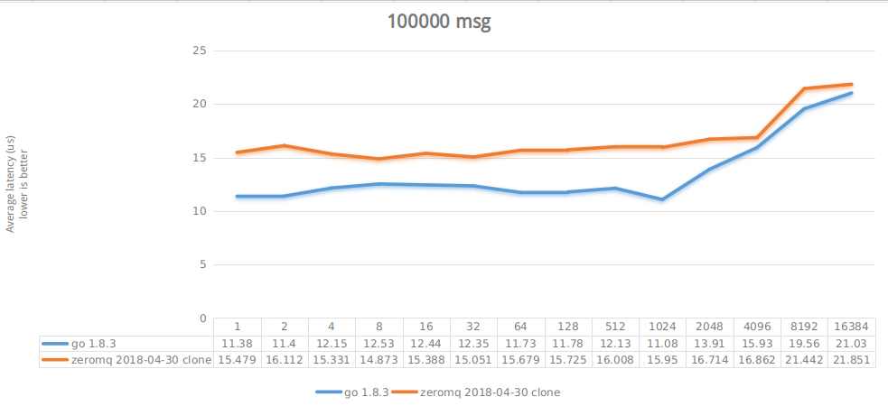

<!-- TOC -->

- [1. 说明](#1-说明)
- [2. Latency benchmark](#2-latency-benchmark)

<!-- /TOC -->

<a id="markdown-1-说明" name="1-说明"></a>
# 1. 说明


参考
* http://zeromq.org/distro:debian (install)
* http://zeromq.org/area:results (benchmark)
* http://zeromq.org/results:perf-howto
* http://zguide.zeromq.org/ (document)
* http://zeromq.org/intro:get-the-software (从源码安装)




库安装的方法
```bash
sudo bash -c "cat >> /etc/apt/sources.list" << EOF
deb http://download.opensuse.org/repositories/network:/messaging:/zeromq:/git-stable/Debian_8.0/ ./
EOF

wget https://download.opensuse.org/repositories/network:/messaging:/zeromq:/git-stable/Debian_8.0/Release.key -O- | sudo apt-key add
sudo apt-get install libzmq3-dev -y

# 卸了把
sudo dpkg -r libzmq3-dev -y

```

不过这次要benchmark,所以要从源码编译出来


```bash
cd refer
git clone https://github.com/zeromq/libzmq
cd libzmq
./autogen.sh && ./configure && make -j 4
make check && sudo make install && sudo ldconfig
```

<a id="markdown-2-latency-benchmark" name="2-latency-benchmark"></a>
# 2. Latency benchmark

zeromq
```bash
cd /media/yq/ST1000DM003/linux/reference/refer/libzmq/perf

for msgSize in 1 2 4 8 16 32 64 128 512 1024 2048 4096 8192 16384; do
  taskset -c 1 ./local_lat tcp://0.0.0.0:5555 $msgSize 100000 & srvpid=$!
  sleep 3
  taskset -c 2 ./remote_lat tcp://127.0.0.1:5555 $msgSize 100000
  kill -9 $srvpid
  sleep 5
done
```


go
```bash
cd /home/yq/go/src/github.com/yqsy/recipes/zeromq/go
mkdir bin
cd local_lat
go build local_lat.go 
mv local_lat ../bin

cd ../remote_lat
go build remote_lat.go 
mv remote_lat ../bin

cd ../bin

for msgSize in 1 2 4 8 16 32 64 128 512 1024 2048 4096 8192 16384; do
  taskset -c 1 ./local_lat 0.0.0.0:5555 $msgSize 100000 & srvpid=$!
  sleep 3
  taskset -c 2 ./remote_lat localhost:5555 $msgSize 100000
  kill -9 $srvpid
  sleep 5
done

```